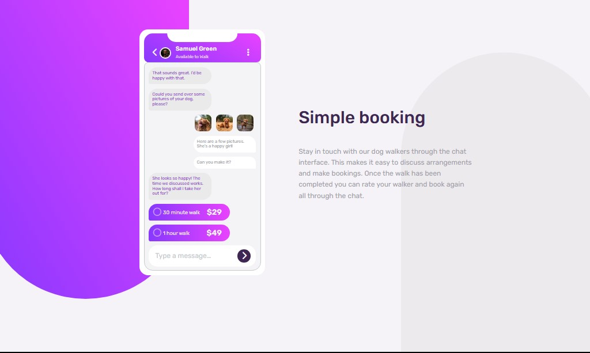
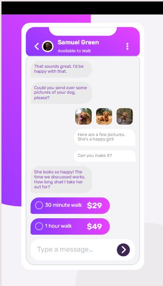
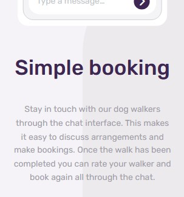

# Frontend Mentor - Testimonials grid section solution

This is a solution to the [Testimonials grid section challenge on Frontend Mentor](https://www.frontendmentor.io/challenges/testimonials-grid-section-Nnw6J7Un7). Frontend Mentor challenges help you improve your coding skills by building realistic projects. 

## Table of contents

- [Overview](ease and it is a good challenge)
  - [The challenge](testimonials-grid-section)
  - [Screenshot]
  - [Screenshot]
  - [Screenshot]
  - [Links](https://github.com/H-wq-prog/chat-app.git)
- [My process](https://h-wq-prog.github.io/chat-app/
)
- [Built with](frontend mentor)

- Solution URL:(https://github.com/H-wq-prog/chat-app.git)
- Live Site URL:(https://h-wq-prog.github.io/chat-app/
)

### Built with

- Semantic HTML5 markup
- CSS custom properties
- Flexbox

- [font awesome](https://fontawesome.com/) - icone library

- Website - (https://buildwithheidi.odoo.com/)
- Frontend Mentor -(https://www.frontendmentor.io/home)
- linked in - (https://www.linkedin.com/in/heidiramdan-4199b723a/)

